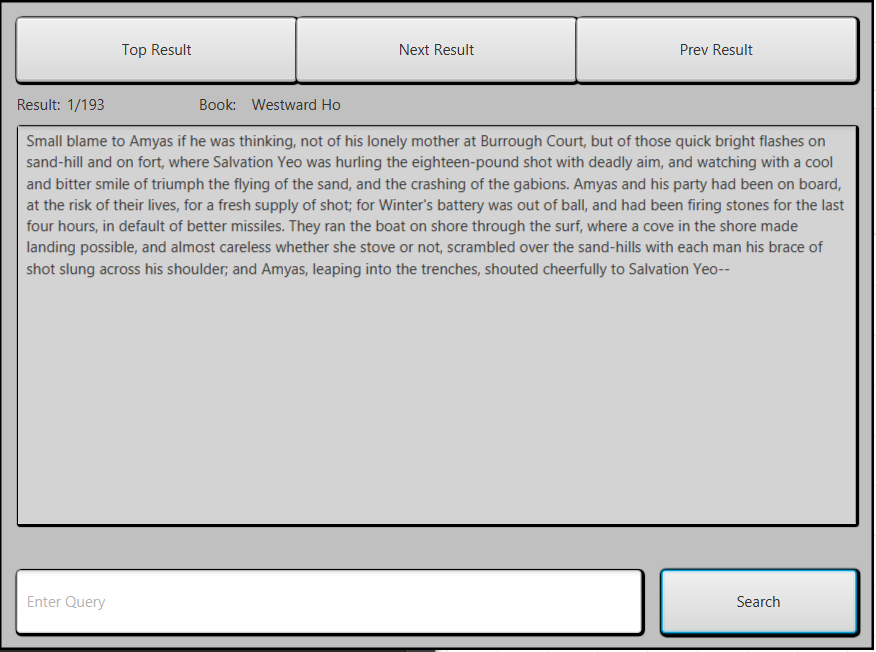

# InformationRetrievalSystem
For ISC-220 

Information retrieval system run on multiple english books in .txt format found [here](https://datarepository.wolframcloud.com/search?i=book)

### Features:
- Term Search
- Phrase Search
- Spell Correction
- Modified TF-IDF ranking

### Flow Graphs:

-

### Dependencies:
- JavaFX library
- txt files of books, assumes that there are empty spaces between paragraphs and the bookname is the file name

### GUI

-
